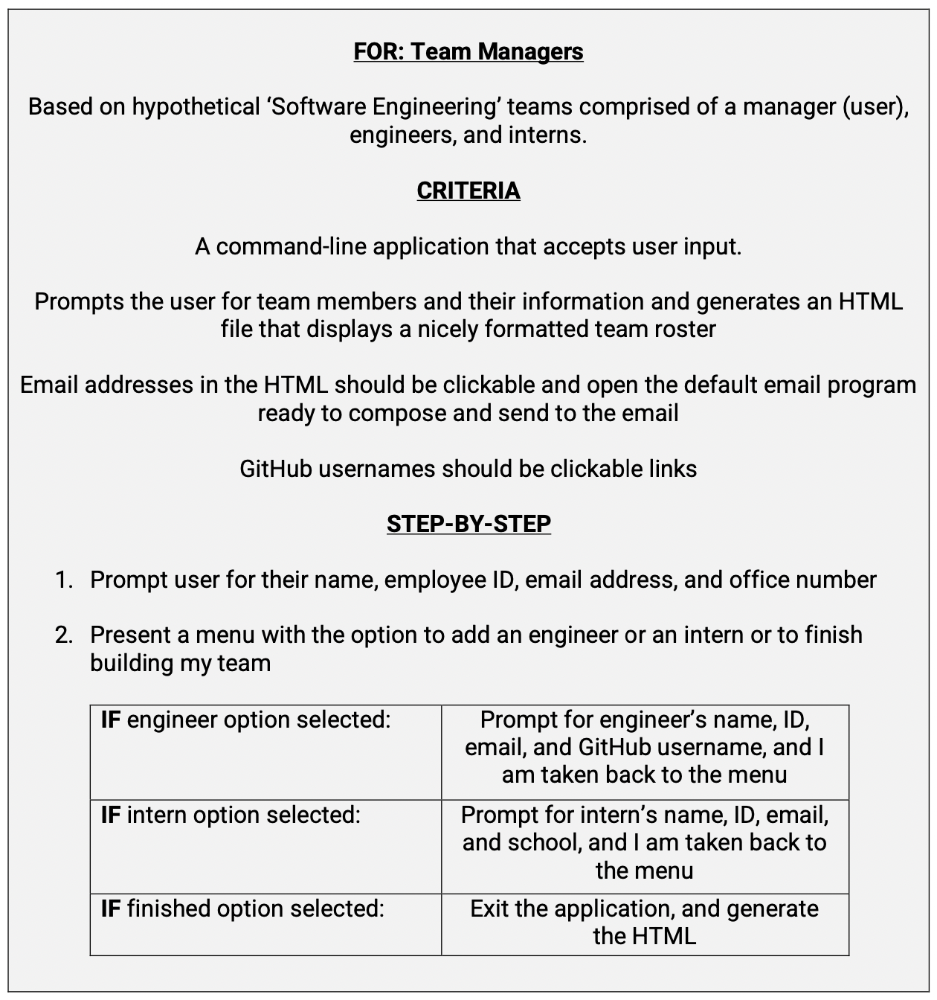

# Team Profile Generator

This project is from [UCF Coding Bootcamp][1]

## <u>Description</u>

A Node.js command-line application that takes in information about employees on a software engineering team and generates an HTML webpage that displays summaries for each person.
 

### Learning Objectives:

- `Object Oriented Programming` 
- `Test Driven Development`

## <u>Dependencies</u>

### Node.js  

    // modules
    const fs = require('fs')
    const inquirer = require('inquirer')
    const jest = require('jest')

## <u>Walkthrough</u>

[Walkthrough Video][usage] <i>demonstrates functionality and tests passing</i>

## <u>Development</u>

  

    
<b>Mockup</b>

    
<b>Criteria</b> 

  

  
  

 

## <u>Tests</u>

[Checkem out][3]
&
[Test Walkthrough Video][4]  
<i> Front intro of this video got cut off but its still solid </i>

## <u>Future Developments</u>

* Give the ability to add more roles/positions
  * And possibly add more criteria for positions

 

* Want to consolidate functions.. especially inquirer prompt functions
  - There is definitely repeat code that I can get rid of
  - Functions should be dynamic and able to accept any of the classes
    - see comments in on [Team.js][5] file & [issues][6]

 

* Need to work on scalability (totally neglected)
  - Works great on large screens but does not scale well, especially with longer emails.. But functionally, I am very happy with this so 🤫

[1]: https://github.com/UCF-Coding-Boot-Camp/UCF-VIRT-BO-FSF-PT-04-2021-U-B/tree/main/10-OOP/02-Challenge
[usage]: https://www.youtube.com/watch?v=spUYy095ViE
[3]: https://github.com/its-jefe/Team-Profile-Generator/tree/main/__tests__
[test]: https://www.youtube.com/watch?v=o7qdDidwnuw
[5]: https://github.com/its-jefe/Team-Profile-Generator/blob/main/lib/Team.js
[6]: https://github.com/its-jefe/Team-Profile-Generator/issues

